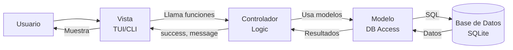

# Arquitectura del Proyecto - Sistema de Gestión de Inventario

## Patrón de Diseño

Este proyecto sigue el patrón de arquitectura **MVC (Modelo-Vista-Controlador)** para una clara separación de responsabilidades:

- **Modelos** (`models/`): Definen la estructura de datos y gestionan el acceso a la base de datos
- **Controladores** (`controllers/`): Contienen la lógica de negocio y coordinan entre modelos y vistas
- **Vistas** (`views/`): Manejan la presentación e interacción con el usuario (TUI y CLI)

## Estructura del Proyecto

```
MiProyectoGit/
├── docs/                        # 📚 Documentación
│   ├── arquitectura.md          # Este archivo - Descripción de la arquitectura
│   ├── patron-mvc.md            # Guía detallada del patrón MVC aplicado
│   ├── implementation_plan.md  # Plan de refactorización MVC
│   └── walkthrough.md           # Documentación de cambios realizados
│
├── mi_entorno/                  # 🐍 Entorno virtual (ignorado por Git)
│   └── ...
│
├── src/                         # 💻 Código Fuente Principal
│   ├── config.py                # ⚙️ Configuración centralizada (DB_PATH, constantes)
│   ├── init_db.py               # 🔧 Script de inicialización de base de datos
│   │
│   ├── models/                  # 📊 MODELO - Capa de Datos
│   │   ├── __init__.py          # Exports: db, BaseModel, init_db, todos los modelos
│   │   ├── database.py          # Conexión SQLite + BaseModel + init_db()
│   │   ├── category.py          # Modelo: Category
│   │   ├── product.py           # Modelo: Product (con property profit)
│   │   ├── inventory.py         # Modelos: Inventory + StockMovement
│   │   └── sale.py              # Modelos: Sale + SaleItem
│   │
│   ├── controllers/             # 🎮 CONTROLADOR - Lógica de Negocio
│   │   ├── __init__.py          # Exports de todas las funciones de negocio
│   │   ├── product_controller.py       # Gestión de productos (7 funciones)
│   │   ├── inventory_controller.py     # Gestión de inventario (6 funciones)
│   │   └── sale_controller.py          # Gestión de ventas (3 funciones)
│   │
│   ├── views/                   # 🎨 VISTA - Interfaces de Usuario
│   │   ├── __init__.py
│   │   ├── tui.py               # Interfaz TUI (Textual)
│   │   ├── cli.py               # Interfaz CLI (línea de comandos)
│   │   └── tui.css              # Estilos para la interfaz TUI
│   │
│   ├── data/                    # 💾 Base de Datos
│   │   └── tienda.db            # Base de datos SQLite
│   │
│   ├── utils/                   # 🔨 Funciones de utilidad
│   │
│   └── __pycache__/             # Cache de Python (ignorado por Git)
│
├── tests/                       # 🧪 Pruebas automatizadas
│
├── .gitignore                   # Configuración de Git
├── Github.txt                   # Notas sobre Git
├── README.md                    # Descripción del proyecto
└── requirements.txt             # 📦 Dependencias del proyecto
```

## Componentes Principales

### 🎨 Capa de Vista (`views/`)

**Responsabilidad**: Presentación e interacción con el usuario

| Archivo | Descripción |
|---------|-------------|
| `tui.py` | Interfaz de usuario en terminal usando Textual. Incluye pantallas para gestión de productos, ventas, inventario |
| `cli.py` | Interfaz de línea de comandos con menú interactivo para todas las funcionalidades |
| `tui.css` | Estilos y diseño para la interfaz TUI |

**Características**:
- ✅ NO contiene lógica de negocio
- ✅ Solo captura entrada y muestra datos
- ✅ Llama a funciones de controladores
- ✅ Validación básica de formato

---

### 🎮 Capa de Controlador (`controllers/`)

**Responsabilidad**: Lógica de negocio y coordinación

#### `product_controller.py`
Gestión de productos del inventario:
- `add_product()` - Agregar nuevo producto con stock inicial
- `toggle_product_status()` - Activar/desactivar productos
- `update_product_details()` - Modificar información de productos
- `get_product_details_by_id()` - Obtener detalles por ID
- `find_product_by_name_or_barcode()` - Búsqueda de productos
- `list_products_by_category()` - Filtrar por categoría
- `apply_expiring_product_offer()` - Aplicar ofertas automáticas

#### `inventory_controller.py`
Gestión de inventario y stocks:
- `record_purchase()` - Registrar compra/entrada de stock
- `list_products_inventory()` - Listar inventario (activos/inactivos)
- `list_available_products()` - Productos con stock disponible
- `list_out_of_stock_products()` - Productos sin stock
- `list_expiring_products()` - Productos próximos a vencer
- `list_categories()` - Listar todas las categorías

#### `sale_controller.py`
Gestión de ventas:
- `record_sale()` - Registrar venta completa (múltiples items)
- `list_sales_history()` - Historial de ventas
- `sales_summary_by_date()` - Resumen de ventas por fecha

**Características**:
- ✅ Valida reglas de negocio
- ✅ Coordina operaciones entre modelos
- ✅ NO conoce detalles de la vista
- ✅ Retorna tuplas (success, message)

---

### 📊 Capa de Modelo (`models/`)

**Responsabilidad**: Estructura de datos y acceso a base de datos

| Archivo | Modelos/Funciones | Descripción |
|---------|-------------------|-------------|
| `database.py` | `db`, `BaseModel`, `init_db()` | Conexión SQLite y configuración Peewee |
| `category.py` | `Category` | Categorías de productos (id, name, description) |
| `product.py` | `Product` | Productos (id, name, barcode, prices, dates, etc.) |
| `inventory.py` | `Inventory`, `StockMovement` | Stock actual y movimientos de entrada/salida |
| `sale.py` | `Sale`, `SaleItem` | Ventas realizadas y sus items |

**Relaciones**:
- `Product` → `Category` (ForeignKey)
- `Inventory` → `Product` (ForeignKey, unique)
- `StockMovement` → `Product` (ForeignKey)
- `SaleItem` → `Sale` (ForeignKey)
- `SaleItem` → `Product` (ForeignKey)

**Características**:
- ✅ Define esquema de base de datos
- ✅ Ejecuta consultas SQL (vía Peewee ORM)
- ✅ NO contiene lógica de negocio compleja
- ✅ NO conoce nada sobre vistas

---

## Flujo de Datos MVC



### Ejemplo: Agregar un producto

1. **Usuario** ingresa datos en formulario TUI  
2. **Vista** (`tui.py`) captura datos y llama `add_product()` del controlador
3. **Controlador** (`product_controller.py`) valida reglas de negocio (ej: precio venta > precio compra)
4. **Controlador** llama al modelo para crear categoría si no existe
5. **Modelo** (`Product`, `Inventory`) inserta datos en BD usando Peewee ORM
6. **Resultado** fluye de vuelta: Modelo → Controlador → Vista → Usuario

---

## Tecnologías Utilizadas

| Componente | Tecnología | Uso |
|------------|-----------|-----|
| **ORM** | Peewee | Mapeo objeto-relacional para SQLite |
| **Base de Datos** | SQLite | Almacenamiento de datos |
| **Interfaz TUI** | Textual | Interfaz de terminal moderna |
| **Interfaz CLI** | argparse + pandas | Línea de comandos con tablas |
| **Lenguaje** | Python 3.13 | Lenguaje principal |

---

## Convenciones de Código

### Imports
```python
# En vistas (views/):
from models import init_db, Product, Category
from controllers import add_product, record_sale

# En controladores (controllers/):
from models import db, Product, Inventory, Category

# En modelos (models/):
from .database import BaseModel
from config import DB_PATH
```

### Nombres de Archivos
- Modelos: `nombre_singular.py` (ej: `product.py`, `category.py`)
- Controladores: `nombre_controller.py` (ej: `product_controller.py`)
- Vistas: `tipo.py` (ej: `tui.py`, `cli.py`)

---

## Ejecución del Proyecto

### Inicializar Base de Datos
```bash
cd src
python init_db.py
```

### Interfaz TUI (Textual)
```bash
cd src
python -m views.tui
```

### Interfaz CLI (Línea de Comandos)
```bash
cd src
python -m views.cli
```

---