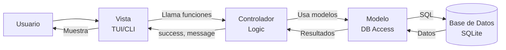

# Arquitectura del Proyecto - Sistema de Gestión de Inventario

## Patrón de Diseño

Este proyecto sigue el patrón de arquitectura **MVC (Modelo-Vista-Controlador)** para una clara separación de responsabilidades:

- **Modelos** (`src/models/`): Definen la estructura de datos y gestionan el acceso a la base de datos
- **Controladores** (`src/controllers/`): Contienen la lógica de negocio y coordinan entre modelos y vistas
- **Vistas** (`src/views/`): Manejan la presentación e interacción con el usuario (TUI y CLI)

## Estructura del Proyecto

```
MiProyectoGit/
├── docs/                        # 📚 Documentación
│   ├── arquitectura.md          # Este archivo - Descripción de la arquitectura
│
├── src/                         # 💻 Código Fuente Principal
│   ├── config.py                # ⚙️ Configuración centralizada (DB_PATH, constantes)
│   ├── init_db.py               # 🔧 Script de inicialización de base de datos
│   │
│   ├── models/                  # 📊 MODELO - Capa de Datos
│   │   ├── __init__.py          # Exports: db, BaseModel, init_db, todos los modelos
│   │   ├── database.py          # Conexión SQLite + BaseModel + init_db()
│   │   ├── category.py          # Modelo: Category
│   │   ├── product.py           # Modelo: Product (con property profit)
│   │   ├── inventory.py         # Modelos: Inventory + StockMovement
│   │   ├── sale.py              # Modelos: Sale + SaleItem
│   │   └── batch.py             # Modelo: Batch (Lotes)
│   │
│   ├── controllers/             # 🎮 CONTROLADOR - Lógica de Negocio
│   │   ├── __init__.py          # Exports de todas las funciones de negocio
│   │   ├── product/             # Subpaquete de gestión de productos
│   │   │   ├── product_crud.py
│   │   │   ├── product_search.py
│   │   │   └── product_business.py
│   │   ├── inventory/           # Subpaquete de gestión de inventario
│   │   │   ├── stock_management.py
│   │   │   ├── inventory_reporting.py
│   │   │   └── category_management.py
│   │   ├── sale/                # Subpaquete de gestión de ventas
│   │   │   ├── sale_transaction.py
│   │   │   └── sale_reporting.py
│   │   └── batch/               # Subpaquete de gestión de lotes
│   │       ├── batch_management.py
│   │       └── batch_maintenance.py
│   │
│   ├── views/                   # 🎨 VISTA - Interfaces de Usuario
│   │   ├── cli/                 # Interfaz de Línea de Comandos (Modular)
│   │   │   ├── actions/         # Acciones específicas (product, inventory, sale, category)
│   │   │   └── menus.py         # Definición de menús
│   │   ├── tui/                 # Interfaz Gráfica de Terminal (Modular)
│   │   │   ├── screens/         # Pantallas individuales (AddProduct, Sale, History, etc.)
│   │   │   ├── widgets/         # Componentes reutilizables
│   │   │   └── app.py           # Clase principal de la aplicación TUI
│   │   └── tui.css              # Estilos para la interfaz TUI
│   │
│   ├── utils/                   # � Funciones de utilidad
│   │   ├── translations.py      # Centralización de textos y traducciones
│   │   └── cli_utils.py         # Utilidades para CLI (tablas, inputs)
│   │
│   └── data/                    # � Base de Datos
│       └── tienda.db            # Base de datos SQLite
│
├── tests/                       # 🧪 Pruebas automatizadas (pytest)
├── main_cli.py                  # Ejecutable para consola (Entry Point)
├── main_tui.py                  # Ejecutable para TUI (Entry Point)
├── requirements.txt             # 📦 Dependencias del proyecto
└── README.md                    # Descripción del proyecto
```

## Componentes Principales

### 🎨 Capa de Vista (`src/views/`)

**Responsabilidad**: Presentación e interacción con el usuario

| Componente | Descripción |
|------------|-------------|
| `views/tui/` | Interfaz de usuario en terminal usando **Textual**. Estructurada en pantallas (`screens`) para cada funcionalidad (Agregar, Modificar, Vender, Historial). |
| `views/cli/` | Interfaz de línea de comandos clásica. Modularizada en acciones (`actions`) para mantener el código organizado. |
| `tui.css` | Hoja de estilos CSS para personalizar la apariencia de la TUI. |

**Características**:
- ✅ NO contiene lógica de negocio compleja.
- ✅ Usa `utils/translations.py` para textos centralizados.
- ✅ Llama a funciones de controladores.

---

### 🎮 Capa de Controlador (`src/controllers/`)

**Responsabilidad**: Lógica de negocio y coordinación. Se ha refactorizado en subpaquetes para mejor mantenibilidad.

#### `product/`
- **CRUD**: Crear, leer, actualizar y eliminar productos.
- **Búsqueda**: Búsqueda por nombre o código de barras.
- **Negocio**: Lógica de precios y validaciones.

#### `inventory/`
- **Stock**: Entradas y salidas de stock.
- **Reportes**: Listados de inventario, bajo stock, próximos a vencer.
- **Categorías**: Gestión de categorías.

#### `sale/`
- **Transacción**: Registro de ventas completas con múltiples items y cálculo de totales.
- **Reportes**: Historial de ventas y resúmenes por fecha.

#### `batch/`
- **Gestión**: Creación y asignación de lotes a productos.
- **Mantenimiento**: Verificación de fechas de vencimiento.

**Características**:
- ✅ Valida reglas de negocio.
- ✅ Coordina operaciones entre modelos.
- ✅ Desacoplado de la vista (retorna estructuras de datos estándar).

---

### 📊 Capa de Modelo (`src/models/`)

**Responsabilidad**: Estructura de datos y acceso a base de datos (ORM Peewee).

| Archivo | Modelos | Descripción |
|---------|---------|-------------|
| `database.py` | `db`, `BaseModel` | Configuración de conexión SQLite. |
| `category.py` | `Category` | Categorías de productos. |
| `product.py` | `Product` | Productos (con propiedades calculadas como `profit`). |
| `inventory.py` | `Inventory`, `StockMovement` | Control de stock y registro de movimientos. |
| `sale.py` | `Sale`, `SaleItem` | Registro de ventas y detalles. |
| `batch.py` | `Batch` | Manejo de lotes y fechas de vencimiento. |

---

## Flujo de Datos MVC



---

## Tecnologías Utilizadas

| Componente | Tecnología | Uso |
|------------|-----------|-----|
| **ORM** | Peewee | Mapeo objeto-relacional para SQLite |
| **Base de Datos** | SQLite | Almacenamiento de datos |
| **Interfaz TUI** | Textual | Interfaz de terminal moderna y reactiva |
| **Interfaz CLI** | Python Standard Lib | Línea de comandos robusta |
| **Testing** | Pytest | Pruebas unitarias y de integración |
| **Lenguaje** | Python 3.13 | Lenguaje principal |

---

## Ejecución del Proyecto

### Inicializar Base de Datos
```bash
python src/init_db.py
```

### Interfaz TUI (Textual)
```bash
python main_tui.py
```

### Interfaz CLI (Línea de Comandos)
```bash
python main_cli.py
```

### Ejecutar Pruebas
```bash
pytest -v
```