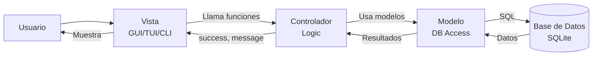

# Arquitectura del Proyecto - Sistema de Gestión de Inventario

## Patrón de Diseño

Este proyecto sigue el patrón de arquitectura **MVC (Modelo-Vista-Controlador)** para una clara separación de responsabilidades:

- **Modelos** (`src/models/`): Definen la estructura de datos y gestionan el acceso a la base de datos
- **Controladores** (`src/controllers/`): Contienen la lógica de negocio y coordinan entre modelos y vistas
- **Vistas** (`src/views/`): Manejan la presentación e interacción con el usuario (GUI, TUI y CLI)

## Estructura del Proyecto

```
MiProyectoGit/
├── docs/                        # Documentación
│   └── arquitectura.md          # Este archivo - Descripción de la arquitectura
│
├── src/                         # Código Fuente Principal
│   ├── config.py                # Configuración centralizada (DB_PATH, constantes)
│   ├── init_db.py               # Script de inicialización de base de datos
│   │
│   ├── models/                  # MODELO - Capa de Datos
│   │   ├── __init__.py          # Exports: db, BaseModel, init_db, todos los modelos
│   │   ├── database.py          # Conexión SQLite + BaseModel + init_db()
│   │   ├── category.py          # Modelo: Category
│   │   ├── product.py           # Modelo: Product
│   │   ├── inventory.py         # Modelos: Inventory + StockMovement
│   │   └── sale.py              # Modelos: Sale + SaleItem
│   │
│   ├── controllers/             # CONTROLADOR - Lógica de Negocio
│   │   ├── __init__.py          # Exports de todas las funciones de negocio
│   │   ├── product/             # Subpaquete de gestión de productos
│   │   │   ├── product_crud.py
│   │   │   ├── product_search.py
│   │   │   └── product_business.py
│   │   ├── inventory/           # Subpaquete de gestión de inventario
│   │   │   ├── stock_management.py
│   │   │   ├── inventory_reporting.py
│   │   │   └── category_management.py
│   │   ├── sale/                # Subpaquete de gestión de ventas
│   │   │   ├── sale_transaction.py
│   │   │   └── sale_reporting.py
│   │   └── reports/             # Subpaquete de generación de reportes
│   │       ├── __init__.py
│   │       └── pdf_generator.py # Generación de PDFs de compras
│   │
│   ├── views/                   # VISTA - Interfaces de Usuario
│   │   ├── gui/                 # Interfaz Gráfica (Tkinter)
│   │   │   ├── app.py           # Aplicación principal GUI
│   │   │   ├── styles.py        # Estilos y colores
│   │   │   ├── components/      # Componentes reutilizables
│   │   │   │   ├── card.py
│   │   │   │   ├── table.py
│   │   │   │   ├── forms.py
│   │   │   │   ├── sidebar.py
│   │   │   │   └── category_combobox.py
│   │   │   └── screens/         # Pantallas principales
│   │   │       ├── dashboard.py
│   │   │       ├── products.py
│   │   │       ├── inventory.py
│   │   │       ├── sales.py
│   │   │       └── categories.py
│   │   ├── cli/                 # Interfaz de Línea de Comandos (Modular)
│   │   │   ├── actions/         # Acciones específicas (product, inventory, sale, category)
│   │   │   └── menus.py         # Definición de menús
│   │   ├── tui/                 # Interfaz Gráfica de Terminal (Modular)
│   │   │   ├── screens/         # Pantallas individuales (AddProduct, Sale, History, etc.)
│   │   │   ├── widgets/         # Componentes reutilizables
│   │   │   └── app.py           # Clase principal de la aplicación TUI
│   │   └── tui.css              # Estilos para la interfaz TUI
│   │
│   ├── utils/                   # Funciones de utilidad
│   │   ├── translations.py      # Centralización de textos y traducciones
│   │   └── cli_utils.py         # Utilidades para CLI (tablas, inputs)
│   │
│   └── data/                    # Base de Datos
│       └── tienda.db            # Base de datos SQLite
│
├── tests/                       # Pruebas automatizadas (pytest)
│   ├── conftest.py              # Configuración y fixtures de pytest
│   ├── test_controllers/        # Pruebas de controladores
│   │   ├── test_product/
│   │   ├── test_inventory/
│   │   ├── test_sale/
│   │   └── test_reports/
│   └── test_models/             # Pruebas de modelos
│       ├── test_product/
│       ├── test_inventory/
│       ├── test_sale/
│       └── test_category/
│
├── reports/                     # Reportes generados
│   └── purchase_reports/        # PDFs de listas de compras
│
├── main_gui.py                  # Ejecutable para GUI (Entry Point)
├── main_cli.py                  # Ejecutable para consola (Entry Point)
├── main_tui.py                  # Ejecutable para TUI (Entry Point)
├── requirements.txt             # Dependencias del proyecto
└── README.md                    # Descripción del proyecto
```

## Componentes Principales

### Capa de Vista (`src/views/`)

**Responsabilidad**: Presentación e interacción con el usuario

| Componente | Descripción |
|------------|-------------|
| `views/gui/` | Interfaz gráfica de usuario usando **Tkinter**. Incluye dashboard con estadísticas de ventas, gestión de productos, inventario, ventas y categorías. Componentes reutilizables (Card, Table, Forms) y estilos centralizados. |
| `views/tui/` | Interfaz de usuario en terminal usando **Textual**. Estructurada en pantallas (`screens`) para cada funcionalidad (Agregar, Modificar, Vender, Historial). |
| `views/cli/` | Interfaz de línea de comandos clásica. Modularizada en acciones (`actions`) para mantener el código organizado. |
| `tui.css` | Hoja de estilos CSS para personalizar la apariencia de la TUI. |

**Características**:
- NO contiene lógica de negocio compleja.
- Usa `utils/translations.py` para textos centralizados.
- Llama a funciones de controladores.
- GUI con diseño moderno y responsivo.

---

### Capa de Controlador (`src/controllers/`)

**Responsabilidad**: Lógica de negocio y coordinación. Se ha refactorizado en subpaquetes para mejor mantenibilidad.

#### `product/`
- **CRUD**: Crear, leer, actualizar y eliminar productos (`add_product`, `update_product_details`, `toggle_product_status`).
- **Búsqueda**: Búsqueda por nombre o código de barras (`find_product_by_name_or_barcode`).
- **Negocio**: Lógica de precios y validaciones (`apply_expiring_product_offer`).

#### `inventory/`
- **Stock**: Entradas de stock (`add_stock`).
- **Reportes**: Listados de inventario, productos disponibles, sin stock, stock bajo (`list_products_inventory`, `list_available_products`, `list_out_of_stock_products`, `get_low_stock_products`).
- **Categorías**: Gestión de categorías (`list_categories`, `update_category`, `delete_category`).

#### `sale/`
- **Transacción**: Registro de ventas completas con múltiples items y cálculo de totales (`record_sale`).
- **Reportes**: Historial de ventas, resúmenes por fecha, productos más vendidos, menos vendidos y no vendidos (`list_sales_history`, `sales_summary_by_date`, `get_top_selling_products`, `get_least_selling_products`, `get_unsold_products`).

#### `reports/`
- **PDF Generator**: Generación de reportes PDF para listas de compras (`generate_purchase_report`).
- **Formato**: Tamaño carta (8.5" x 11"), márgenes de 1cm, campos manuales para cantidad y costo.
- **Secciones**: Productos sin stock y productos con stock bajo (umbral configurable: 10, 20, 30, 40, 50, 100).
- **Salida**: PDFs guardados en `reports/purchase_reports/` con timestamp.

**Características**:
- Valida reglas de negocio.
- Coordina operaciones entre modelos.
- Desacoplado de la vista (retorna estructuras de datos estándar).
- Manejo de conexiones a base de datos.

---

### Capa de Modelo (`src/models/`)

**Responsabilidad**: Estructura de datos y acceso a base de datos (ORM Peewee).

| Archivo | Modelos | Descripción |
|---------|---------|-------------|
| `database.py` | `db`, `BaseModel` | Configuración de conexión SQLite. |
| `category.py` | `Category` | Categorías de productos. |
| `product.py` | `Product` | Productos con campos: name, barcode, category, sale_price, location, active. |
| `inventory.py` | `Inventory`, `StockMovement` | Control de stock y registro de movimientos. |
| `sale.py` | `Sale`, `SaleItem` | Registro de ventas y detalles de items vendidos. |

---

## Flujo de Datos MVC



---

## Tecnologías Utilizadas

| Componente | Tecnología | Uso |
|------------|-----------|-----|
| **ORM** | Peewee | Mapeo objeto-relacional para SQLite |
| **Base de Datos** | SQLite | Almacenamiento de datos |
| **Interfaz GUI** | Tkinter | Interfaz gráfica de escritorio |
| **Interfaz TUI** | Textual | Interfaz de terminal moderna y reactiva |
| **Interfaz CLI** | Python Standard Lib | Línea de comandos robusta |
| **PDF Generation** | ReportLab | Generación de reportes PDF |
| **Testing** | Pytest | Pruebas unitarias y de integración |
| **Coverage** | pytest-cov | Análisis de cobertura de código |
| **Lenguaje** | Python 3.13 | Lenguaje principal |

---

## Ejecución del Proyecto

### Inicializar Base de Datos
```bash
python src/init_db.py
```

### Interfaz GUI (Gráfica)
```bash
python main_gui.py
```

### Interfaz TUI (Textual)
```bash
python main_tui.py
```

### Interfaz CLI (Línea de Comandos)
```bash
python main_cli.py
```

### Ejecutar Pruebas
```bash
# Todas las pruebas
pytest tests/ -v

# Solo pruebas de modelos
pytest tests/test_models/ -v

# Con cobertura
pytest tests/ --cov=src --cov-report=html
```

---

## Suite de Pruebas

### Estructura de Tests

```
tests/
├── conftest.py              # Fixtures compartidas
├── test_controllers/        # Pruebas de controladores
│   ├── test_product/
│   ├── test_inventory/
│   ├── test_sale/
│   └── test_reports/
└── test_models/             # Pruebas de modelos
    ├── test_product/
    ├── test_inventory/
    ├── test_sale/
    └── test_category/
```

### Estadísticas de Pruebas

- **Total de pruebas**: 29
- **Pruebas exitosas**: 18 (62%)
- **Cobertura de código**: 9%
- **Tiempo de ejecución**: ~1.5s

### Pruebas por Categoría

| Categoría | Tests | Pasando | Porcentaje |
|-----------|-------|---------|------------|
| Models | 16 | 15 | 94% |
| Controllers | 13 | 3 | 23% |
| **Total** | **29** | **18** | **62%** |

### Cobertura por Módulo

- `models/`: 100%
- `controllers/reports/pdf_generator.py`: 74%
- `controllers/inventory/stock_management.py`: 65%
- `controllers/product/product_crud.py`: 45%
- `controllers/sale/sale_transaction.py`: 44%

### Notas sobre Pruebas

- Las pruebas de modelos tienen alta tasa de éxito (94%)
- Las pruebas de controllers tienen conflictos de conexión a BD
- Los tests de PDF Generator y búsqueda funcionan al 100%
- Se recomienda refactorizar controllers para mejor testabilidad